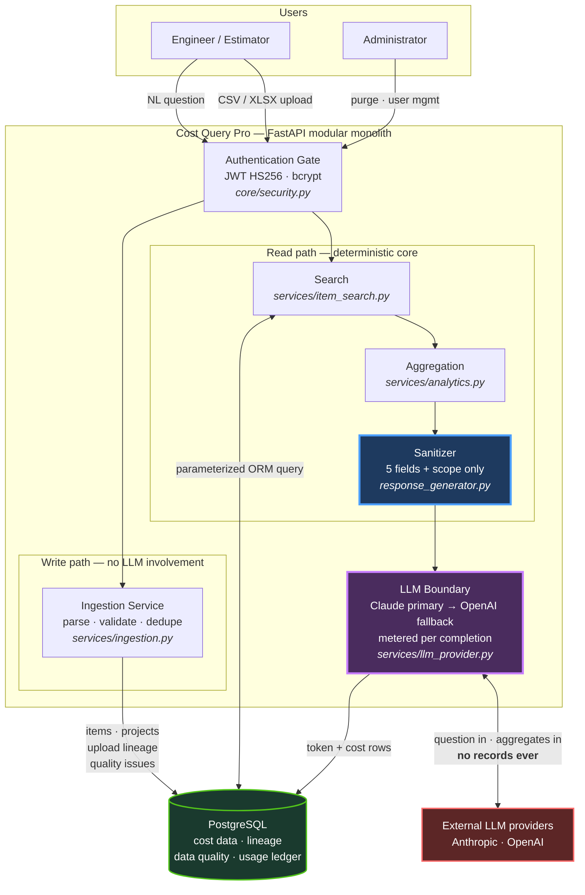
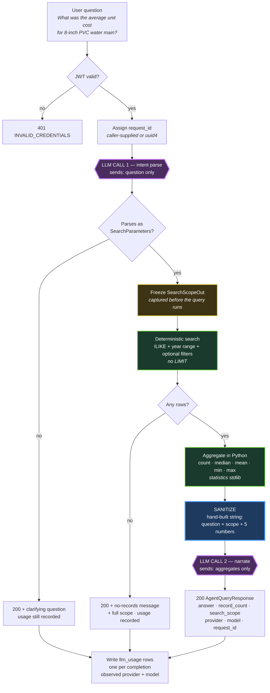
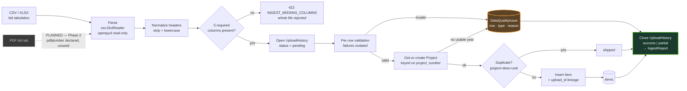
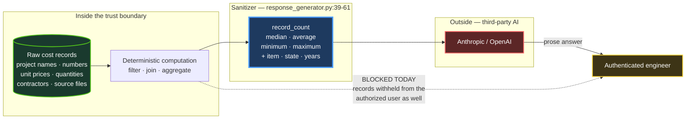

# Deliverable 2 — Architecture Diagram

---

## Validation of the proposed diagram

The review prompt offered a candidate flow and asked that it not be assumed correct. Checked
against the repository, it is **directionally right and structurally wrong in four ways**:

| Proposed | Reality in the repository | Correction |
| --- | --- | --- |
| One linear chain from ingestion through to answer | Two **independent lifecycles** that meet only at the database. Ingestion has no LLM; querying performs no writes except the usage ledger | Split into two flows |
| "Intent Parsing" as a neutral step | Intent parsing **is an LLM call** — the first of exactly two, and the one that decides which records get counted | Mark it as an LLM boundary crossing |
| "Validation / Normalization" as a pass/fail gate | Validation is **row-isolated with partial success**; failures persist as `DataQualityIssue` rows rather than aborting the file | Show the data-quality side output |
| "Answer + Search Scope / Provenance" | Scope is real. Record-level provenance is **not returned** — the response carries `record_count` and filters only | Label scope-level, not record-level |

Additionally missing from the proposal: the authentication gate, the LLM cost ledger, and the
provider-failover path. All three are load-bearing.

---

## Diagram 1 — System context (the slide-4 diagram)

**The one thing to point at:** the double-headed arrow to *External LLM providers* carries the
user's question outbound and aggregates outbound. It never carries a database row. That edge is
the whole architecture.

---

## Diagram 2 — Query lifecycle (the slide-6 diagram)

**Three things worth pausing on:**

- **Purple stages are the only two LLM calls.** There is no loop, no tool-calling turn, no
  retry. The number of external AI calls per query is exactly two, always.
- **Scope is frozen before the query executes** (`api/agent.py:141-149`), so the returned
  provenance describes the intended search even when it returns nothing.
- **Every terminal path writes the usage ledger**, including the two that return early. This is
  a deliberate correctness property, documented at `api/agent.py:106-118`.

---

## Diagram 3 — Ingestion lifecycle

**The dashed PDF node is doing real work in this diagram.** Multi-format ingestion was an
intentional design consideration from project inception — `pdfplumber` and `pdfminer-six` are
declared dependencies (`pyproject.toml:23,34`), PDF appears in the earliest scope documents,
and the extraction requirements are specified in detail. It is nonetheless **not implemented**.
Draw it dashed and say so; claiming otherwise is the fastest way to lose credibility with
another engineer who will look at the code.

---

## Diagram 4 — The trust boundary (the slide-8 diagram)

This is the one to use when the security conversation starts. It is the same system, redrawn
around *what crosses which line*.

**The dotted line is the most interesting thing in this review.** Withholding raw records from
the *LLM* is the correct and intended control. Withholding them from the *authenticated human
who is authorized to see them* is an over-application of that control — and it is why
provenance is currently scope-level rather than record-level, against the original business
requirement in `docs/00_overview/00_business_scope.md` §3. Discussed in
[Deliverable 9](09_architecture_risks.md), R-4.
